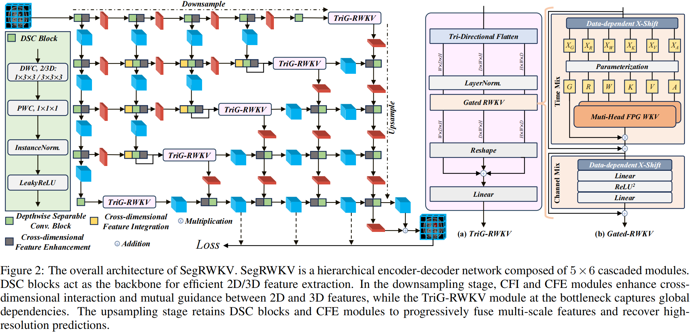
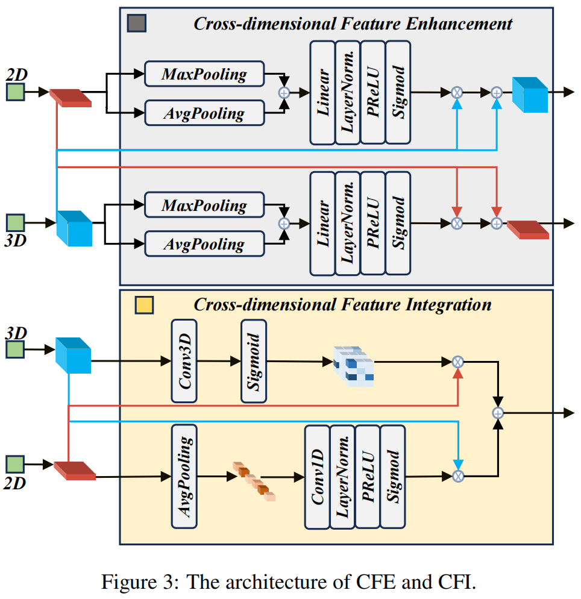
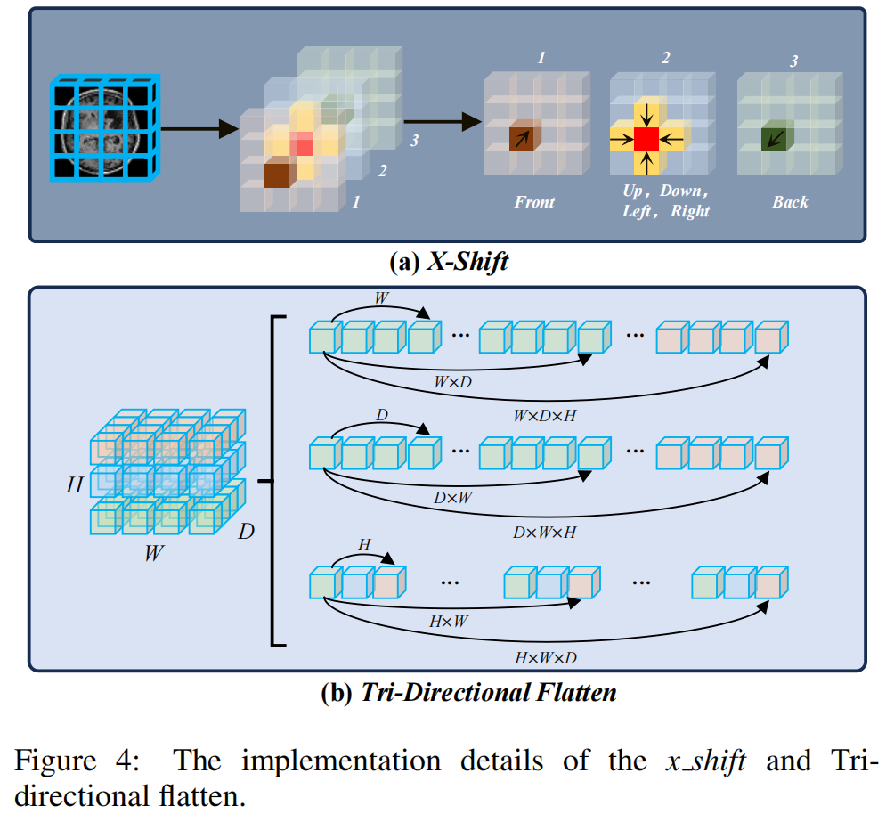
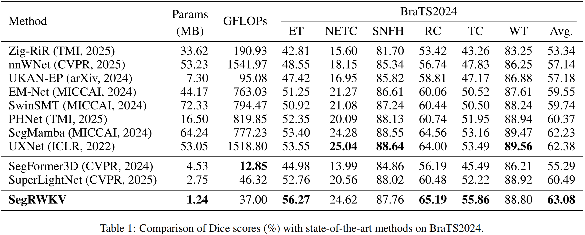
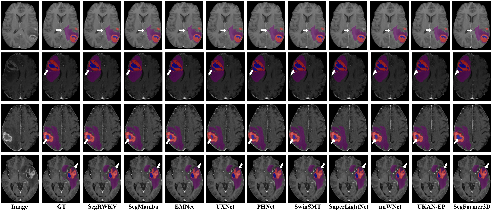

<div align="center">
	
# 🧩 SegRWKV: Linear-Complexity RWKV for Efficient 3D Medical Image Segmentation

</div>

## The overall architecture of SegRWKV



| Cross-dimensional Feature Enhancement and Cross-dimensional Feature Integration. | X-Shift and Tri-Directional Flatten. |
|---|---|
|  |  |

> Example Results on BraTS 2024.



> Visual Results on BraTS 2023.



## ⚡ Data downloading

### BraTS 2023 and BraTS 2024

Data of BraTS 2023 is from [https://www.synapse.org/Synapse:syn51156910/wiki/621282](https://www.synapse.org/Synapse:syn51156910/wiki/621282)

Data of BraTS 2024 is from [https://www.synapse.org/Synapse:syn53708249/wiki/626323](https://www.synapse.org/Synapse:syn53708249/wiki/626323)

The BraTS 2023/2024 structure will be in this format:

<table style="width: 100%; table-layout: fixed;">
  <thead>
    <tr>
      <th align="center">BraTS 2023</th>
      <th align="center">BraTS 2024</th>
    </tr>
  </thead>
  <tbody>
    <tr>
      <td valign="top">
<pre>
data/
└── ASNR-MICCAI-BraTS2023-GLI-Challenge-TrainingData/
    ├── BraTS-GLI-00000-000/
    │   ├── BraTS-GLI-00000-000-seg.nii.gz
    │   ├── BraTS-GLI-00000-000-t1c.nii.gz
    │   ├── BraTS-GLI-00000-000-t1n.nii.gz
    │   ├── BraTS-GLI-00000-000-t2f.nii.gz
    │   └── BraTS-GLI-00000-000-t2w.nii.gz
    ├── BraTS-GLI-00002-000/
    │   └── ...
    ├── BraTS-GLI-00003-000/
    │   └── ...
    └── ...
</pre>
      </td>
      <td valign="top">
<pre>
data/
└── BraTS2024-BraTS-GLI-TrainingData/
    ├── BraTS-GLI-00005-100/
    │   ├── BraTS-GLI-00005-100-seg.nii.gz
    │   ├── BraTS-GLI-00005-100-t1c.nii.gz
    │   ├── BraTS-GLI-00005-100-t1n.nii.gz
    │   ├── BraTS-GLI-00005-100-t2f.nii.gz
    │   └── BraTS-GLI-00005-100-t2w.nii.gz
    ├── BraTS-GLI-00005-101/
    │   └── ...
    ├── BraTS-GLI-00006-100/
    │   └── ...
    └── ...
</pre>
      </td>
    </tr>
  </tbody>
</table>

### AMOS 2022
 
Data is from [https://amos22.grand-challenge.org/](https://amos22.grand-challenge.org/)

The data structure will be in this format:

```text
data/
└── amos22/
    ├── imagesTr/
    │   ├── amos_0001.nii.gz
    │   ├── amos_0004.nii.gz
    │   ├── amos_0005.nii.gz
    │   └── ...
    ├── imagesVal/
    │   └── ...
    ├── labelsTr/
    │   ├── amos_0001.nii.gz
    │   ├── amos_0004.nii.gz
    │   ├── amos_0005.nii.gz
    │   └── ...
    ├── labelsVal/
    │   └── ...
    ├── dataset.json
    └── readme.md
```

### MSD Task01-Task10

Data is from [http://medicaldecathlon.com/](http://medicaldecathlon.com/)

The Task01-Task10 structure is similar to AMOS 2022.

For the needs of the experiment, we only need to organize Task01_BrainTumour into the following data structure (similar to BraTS 2023/2024).

```text
data/
└── Task01_BrainTumour/
    ├── BRATS_001/
    │   ├── img.nii.gz
    │   └── seg.nii.gz
    ├── BRATS_002/
    │   ├── img.nii.gz
    │   └── seg.nii.gz
    ├── BRATS_003/
    │   ├── img.nii.gz
    │   └── seg.nii.gz
    ├── BRATS_004/
    │   └── ...
    ├── BRATS_005/
    │   └── ...
    └── ...
```

## ⚡ Environment install

### Configuring your environment

Creating a virtual environment in terminal: `conda create -n SegRWKV python=3.10`

Enter the environment: `conda activate SegRWKV`

Install the necessary packages: `pip install -r requirements.txt`


## ⚡ Preprocessing, training, and testing

### Brain Tumour - BraTS 2023，BraTS 2024 and MSD Task01

#### 🆓 Preprocessing
In my setting:

The data directory of BraTS 2023 is : **"./data/ASNR-MICCAI-BraTS2023-GLI-Challenge-TrainingData/"**;
			   
The data directory of BraTS 2024 is : **"./data/BraTS2024-BraTS-GLI-TrainingData/"**;
			   
The data directory of MSD Task01 is : **"./data/Task01_BrainTumour/"**.


First, we need to run the rename process (Only for BraTS 2023 and BraTS 2024).

```bash 
python 1_rename_mri_data_BraTS2023.py    or    python 1_rename_mri_data_BraTS2024.py
```

Then, we need to run the pre-processing code to do resample, normalization, and crop processes (For all three datasets).

```bash
python 2_preprocessing_BraTS2023.py    or    python 2_preprocessing_BraTS2024.py    or    python 2_preprocessing_Task1.py
```

#### 🆓 Training 

When the pre-processing process is done, we can train our model.

**Dataset Splits**
| Dataset / Task                 | Test list path / Notes                                                                 |
|--------------------------------|---------------------------------------------------------------------------------------|
| BraTS 2023                      | `./BraTS_2023/data/test_list.py`                                                     |
| BraTS 2024                      | `./BraTS_2024/data/test_list.py`                                                     |
| MSD Task01                     | `./MSD_Task01/data/test_list.py`                                                     |
| MSD Task02–Task10              | Dataset partitioning used **random seed = 0** (ensures reproducibility)              |


We mainly use the pre-processde data from last step: **data_dir = ./data/train_fullres_process**


```bash 
python 3_train.py
```

#### 🆓 Testing

When we have trained our models, we can inference all the data in testing set.

We mainly use the pre-processde data from "Preprocessing" step: **data_dir = ./data/train_fullres_process**; 

The original data (**"./data/ASNR-MICCAI-BraTS2023-GLI-Challenge-TrainingData/" || "./data/BraTS2024-BraTS-GLI-TrainingData/" || "./data/Task01_BrainTumour/"**);

And the parameter you get from last step: **model_path = ./data/3D_parameter/SegRWKV_BraTS_2023.pth || ./data/3D_parameter/SegRWKV_BraTS_2024.pth || ./data/3D_parameter/SegRWKV_Task01_BrainTumour.pth**.

```bash 
python 4_predict_assemble_save.py
```

### Other organs - AMOS 2022 and MSD Task02-Task10

#### 🆓 Training 

The **preprocessing** process is embedded within the training process, we can train our model.

Choose the  **'train'** mode:
 **parser.add_argument('--mode', type=str, default='train', help='Training or testing mode')**

```bash 
python main_train_AMOS_2022.py    or    python main_train_MSD_Task02_10.py
```
#### 🆓 Testing

Choose the  **'validation'** mode:
 **parser.add_argument('--mode', type=str, default='validation', help='Training or testing mode')**

```bash 
python main_train_AMOS_2022.py    or    python main_train_MSD_Task02_10.py
```


